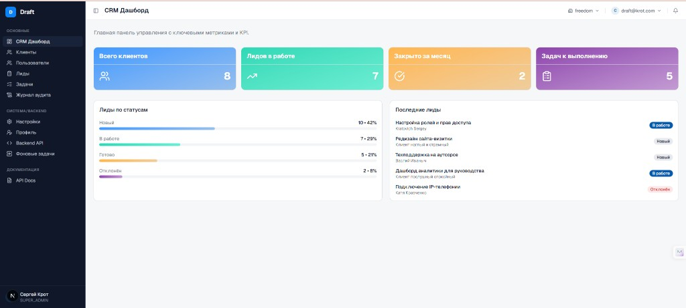
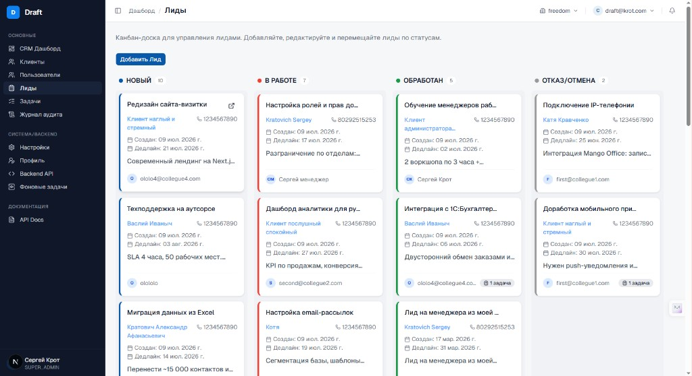
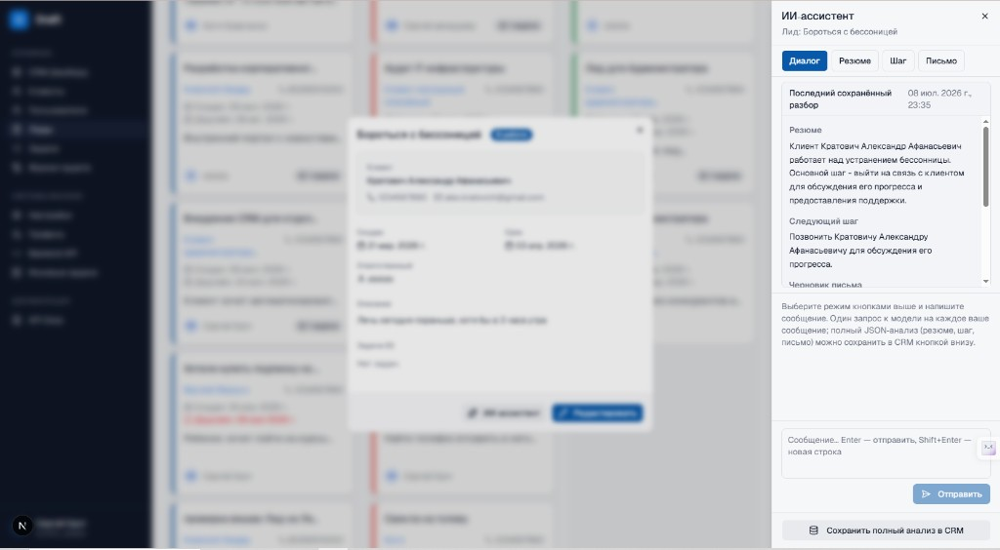
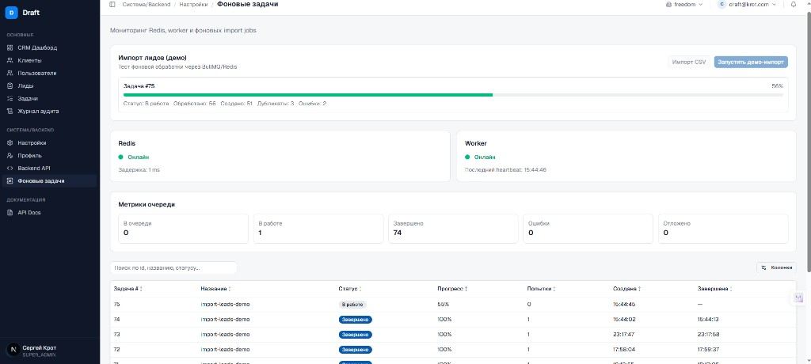
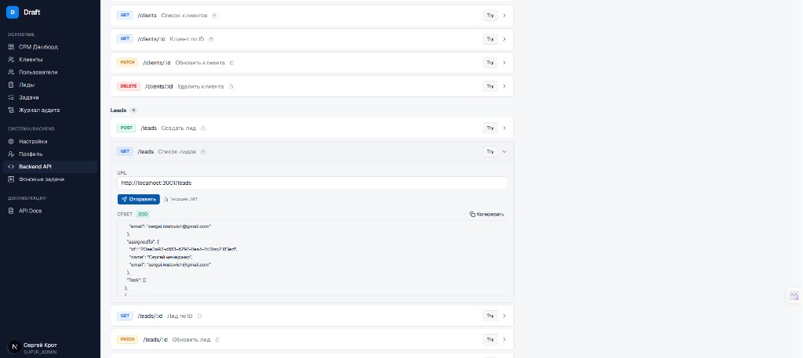
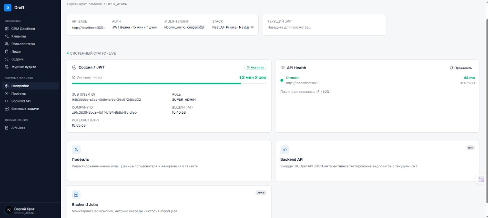
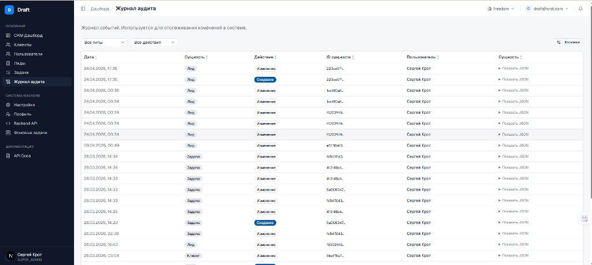
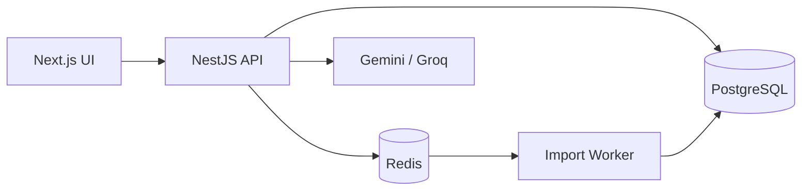

# CRM Platform

**A production-style, multi-tenant SaaS CRM** for lead management, client workflows, and team operations — built end-to-end to production standards.

[](https://nestjs.com/)
[](https://nextjs.org/)
[](https://www.typescriptlang.org/)
[](https://www.postgresql.org/)
[](https://redis.io/)
[](https://www.prisma.io/)

> **For recruiters:** a full business application — CRM dashboard, Kanban pipeline, role-based access, audit trail, and an AI assistant that helps sales managers act on leads faster.
>
> **For engineers:** real SaaS concerns — tenant isolation, JWT auth, Swagger API, background jobs via BullMQ/Redis, structured AI responses persisted to PostgreSQL, and a separate worker process.

**Live demo:** not available (hosted instance expired). The project runs locally in ~5 minutes with Docker Compose. Screenshots below reflect the actual UI.

---

## Screenshots

| Dashboard & KPIs | Lead Kanban pipeline |
|---|---|
|  |  |

| AI assistant inside a lead | Background jobs (BullMQ + Redis) |
|---|---|
|  |  |

| API playground (JWT) | System settings & health |
|---|---|
|  |  |

| Audit log |
|---|
|  |

---

## What this project demonstrates

This is not a tutorial CRUD app. It models how a small B2B SaaS product is actually structured:

- **Multi-tenant data isolation** — every record scoped by `companyId`; one user belongs to one company
- **Role-based access control** — `SUPER_ADMIN`, `OWNER`, `ADMIN`, `MANAGER`, `EMPLOYEE`
- **Sales workflow** — leads move through a Kanban pipeline (`NEW` → `IN_PROGRESS` → `DONE` / `REJECTED`)
- **Operational visibility** — dashboard metrics, audit log with JSON snapshots, built-in API health checks
- **Async processing** — CSV lead imports handled by a dedicated worker, not blocking HTTP requests
- **AI as a product feature** — structured analysis (summary, next action, draft email) saved to the database, with provider fallback

---

## Key features

### Business / product

- CRM dashboard with lead funnel stats and recent activity
- Client, lead, and task management
- Kanban board for the sales pipeline
- Team management with roles and permissions
- Audit log for tracking who changed what
- AI assistant embedded in the lead detail view

### Engineering

- REST API with **Swagger** (`/api`) and OpenAPI JSON (`/api/json`)
- **JWT** authentication with refresh flow; interactive API testing from the UI
- **Prisma** ORM + PostgreSQL migrations
- **BullMQ** job queue on **Redis** with a standalone worker process
- Real-time job monitoring UI — queue metrics, progress, import stats
- **GitHub Actions** CI for backend build and tests
- Docker Compose for local Postgres + Redis

### AI assistant (leads)

The backend loads lead context (client, tasks, status) and returns structured output:

| Endpoint | Purpose |
|----------|---------|
| `POST /leads/:id/ai-analyze` | Full structured analysis → saved to `LeadAiAnalysis` |
| `POST /leads/:id/ai-chat` | Contextual chat (`CHAT`, `SUMMARY`, `NEXT_ACTION`, `DRAFT_EMAIL`) |
| `GET /leads/:id/ai-analysis/latest` | Retrieve the last saved analysis snapshot |

Providers: **Gemini** or **Groq** (configurable via env). Responses match the lead data language (RU/EN). Invalid provider output triggers a safe fallback — the UI keeps working.

---

## Architecture



```
crm-platform/
├── backend/          # NestJS REST API + Prisma
│   └── src/worker/   # BullMQ import worker (separate process)
├── frontend/         # Next.js 16, React 19, App Router
├── infra/            # Docker Compose: Postgres + Redis
└── docs/             # Technical documentation (RU)
```

---

## Tech stack

| Layer | Technologies |
|-------|-------------|
| Backend | NestJS 11, TypeScript, Prisma 7, Passport JWT |
| Database | PostgreSQL 15 |
| Queue | Redis 7, BullMQ, dedicated worker |
| Frontend | Next.js 16, React 19, TanStack Query & Table, Zustand |
| UI | Tailwind CSS, Radix UI, shadcn-style components |
| AI | Gemini / Groq (server-side, structured JSON) |
| DevOps | Docker Compose, GitHub Actions |

---

## Quick start

**Requirements:** Node.js 20+, Yarn, Docker & Docker Compose

```bash
# 1. Infrastructure
cd infra && docker compose up -d

# 2. Backend
cd backend
yarn install
cp .env.example .env   # edit DATABASE_URL, JWT_SECRET, optional AI keys
npx prisma migrate deploy
yarn start:dev         # http://localhost:3001

# 3. Worker (separate terminal — required for background imports)
cd backend && yarn worker

# 4. Frontend
cd frontend
yarn install
cp .env.example .env.local
yarn dev               # http://localhost:3000
```

Register a company via the UI (`/auth/register`), then explore the dashboard, leads Kanban, AI assistant, and background jobs page.

Full setup guide (environment variables, ports, troubleshooting): **[docs/SETUP.md](docs/SETUP.md)** *(Russian)*

---

## Documentation

Technical docs are maintained in Russian:

| Document | Description |
|----------|-------------|
| [docs/README.md](docs/README.md) | Documentation index |
| [docs/ARCHITECTURE.md](docs/ARCHITECTURE.md) | Architecture, data model, folder structure |
| [docs/SETUP.md](docs/SETUP.md) | Installation and environment variables |
| [docs/API.md](docs/API.md) | REST API reference |
| [docs/MAINTENANCE.md](docs/MAINTENANCE.md) | How to keep docs up to date |

**Swagger UI:** `http://localhost:3001/api` (after backend start)

---

## About

Solo full-stack project — from database schema and API design to UI, background processing, and AI integration.

If you're reviewing this for a hiring decision: start with the **screenshots**, then `docs/ARCHITECTURE.md` for system design, or clone and run locally via Quick Start above.

---

## License

Private project. All rights reserved.
