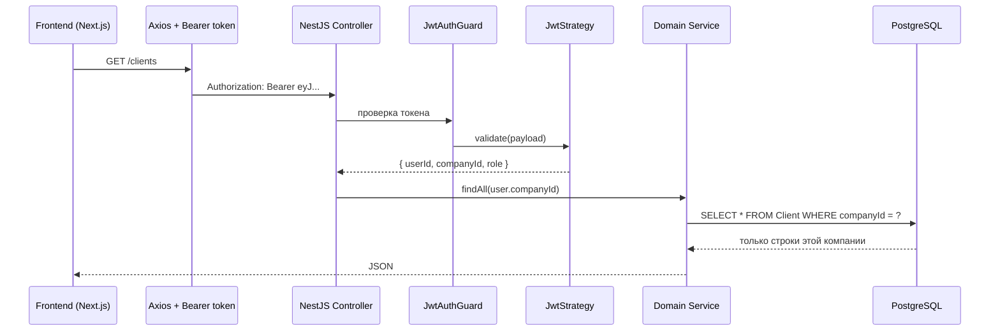
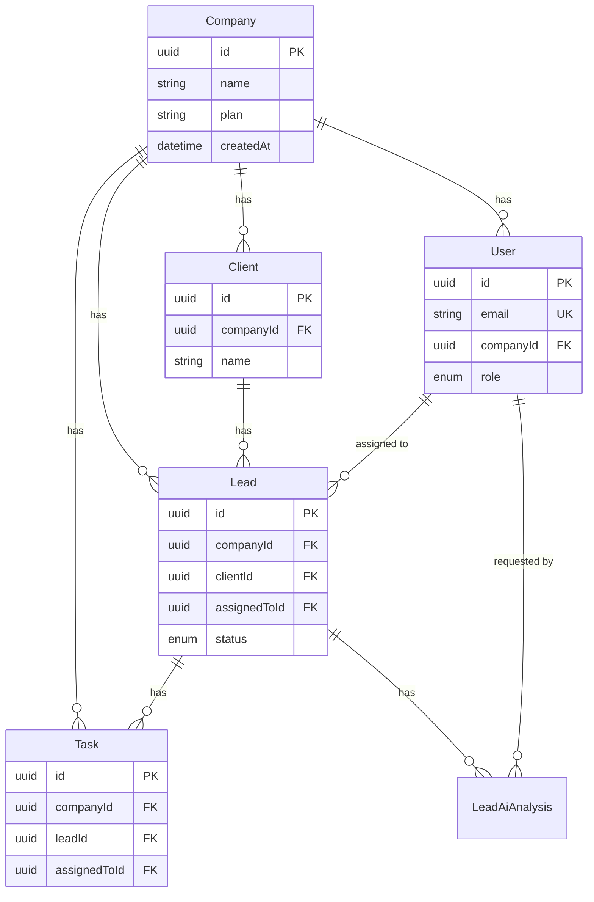
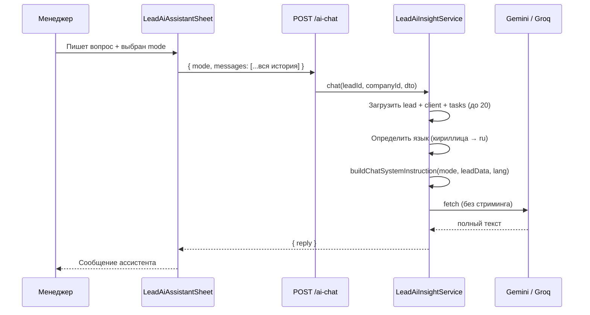
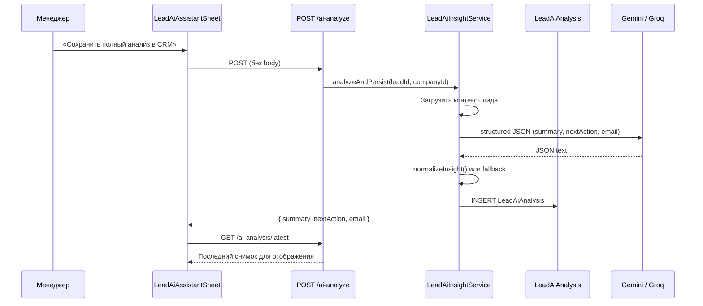

# Личные заметки: как у нас всё устроено

> Файл для себя — чтобы вспомнить архитектуру через полгода.  
> Проект: CRM Platform (NestJS + Next.js + PostgreSQL).  
> Дата: июль 2026.

---

## Содержание

1. [Multi-tenant: общая картина](#1-multi-tenant-общая-картина)
2. [Multi-tenant: поток запроса](#2-multi-tenant-поток-запроса)
3. [Multi-tenant: схема БД](#3-multi-tenant-схема-бд)
4. [Multi-tenant: ключевые файлы](#4-multi-tenant-ключевые-файлы)
5. [Multi-tenant: что я делал и на что обратить внимание](#5-multi-tenant-что-я-делал-и-на-что-обратить-внимание)
6. [ИИ-ассистент: общая картина](#6-ии-ассистент-общая-картина)
7. [ИИ-ассистент: два режима](#7-ии-ассистент-два-режима)
8. [ИИ-ассистент: поток данных](#8-ии-ассистент-поток-данных)
9. [ИИ-ассистент: промпты и провайдеры](#9-ии-ассистент-промпты-и-провайдеры)
10. [ИИ-ассистент: fallback и ошибки](#10-ии-ассистент-fallback-и-ошибки)
11. [ИИ-ассистент: ключевые файлы](#11-ии-ассистент-ключевые-файлы)
12. [Что НЕ сделано (честный список)](#12-что-не-сделано-честный-список)

---

## 1. Multi-tenant: общая картина

### Терминология

| Как говорят в индустрии | Как у нас в коде |
|-------------------------|------------------|
| Tenant (тенант)         | `Company`        |
| Tenant ID               | `companyId`      |
| `tenant_id`             | **не используется** |

### Модель изоляции

**Shared Database + Shared Schema** — одна PostgreSQL, одна схема, все компании в одних таблицах.

```
┌─────────────────────────────────────────────────────────────┐
│                    PostgreSQL (одна БД)                        │
├─────────────────────────────────────────────────────────────┤
│                                                              │
│   Company (корень тенанта, без companyId)                   │
│     │                                                        │
│     ├── User[]         ← companyId                          │
│     ├── Client[]       ← companyId                          │
│     ├── Lead[]         ← companyId + clientId               │
│     ├── Task[]         ← companyId                          │
│     ├── LeadAiAnalysis ← companyId                          │
│     └── AuditLog       ← companyId                          │
│                                                              │
│   Изоляция: WHERE companyId = ? в каждом запросе            │
│                                                              │
└─────────────────────────────────────────────────────────────┘
```

### Чего у нас НЕТ

- Отдельной БД на каждую компанию
- PostgreSQL Row Level Security (RLS)
- Prisma middleware / `$extends` для автофильтрации
- Отдельного `TenantMiddleware` в NestJS
- Заголовка `X-Tenant-Id` с фронта

### Что ЕСТЬ

- `companyId` в JWT при логине
- Ручная фильтрация `where: { companyId }` в каждом сервисе
- Один пользователь = одна компания (нет membership в нескольких)

### Правило, которое держит всё вместе

```
Регистрация → создаётся Company + User(companyId)
Логин       → JWT содержит { sub, companyId, role }
Любой API   → JwtAuthGuard → @CurrentUser() → service(..., user.companyId)
```

---

## 2. Multi-tenant: поток запроса



### Регистрация = создание тенанта

Файл: `backend/src/modules/auth/auth.service.ts`

```
POST /auth/register { email, password, companyName }
  1. prisma.company.create({ name: companyName, plan: 'FREE' })
  2. prisma.user.create({ email, password, companyId: company.id })
  3. токен НЕ выдаётся — нужен отдельный login
```

### Логин = привязка к тенанту

```
POST /auth/login { email, password }
  → JWT payload: { sub: userId, companyId, email, role }
  → accessToken (15 мин) + refreshToken
```

### Типичный контроллер

```typescript
// clients.controller.ts — паттерн повторяется везде
@UseGuards(JwtAuthGuard)
@Get()
findAll(@CurrentUser() user) {
  return this.clientsService.findAll(user.companyId);
}
```

Тот же паттерн: `leads`, `tasks`, `dashboard`, `audit-log`, `users`.

---

## 3. Multi-tenant: схема БД

### ER-диаграмма (упрощённо)



### Индексы

На всех tenant-scoped таблицах есть `@@index([companyId])` — важно для производительности при росте данных.

### Кросс-сущностная валидация

При создании лида проверяется, что `clientId` и `assignedToId` принадлежат **той же** `companyId`:

```typescript
// leads.service.ts — при create()
const client = await prisma.client.findFirst({
  where: { id: dto.clientId, companyId },
});
if (!client) throw new NotFoundException('Client not found');
```

Без этого можно было бы привязать лид к клиенту чужой компании.

---

## 4. Multi-tenant: ключевые файлы

| Что | Путь |
|-----|------|
| Схема Prisma | `backend/prisma/schema.prisma` |
| Регистрация + JWT | `backend/src/modules/auth/auth.service.ts` |
| Извлечение companyId из JWT | `backend/src/modules/auth/strategies/jwt.strategy.ts` |
| Guard | `backend/src/modules/auth/guards/jwt-auth.guard.ts` |
| Декоратор `@CurrentUser()` | `backend/src/modules/auth/decorators/current-user.decorator.ts` |
| CRUD компаний | `backend/src/modules/company/` |
| Пример tenant-scoped сервиса | `backend/src/modules/clients/clients.service.ts` |
| Auth store на фронте | `frontend/src/features/auth/store/auth.store.ts` |
| Axios interceptor (Bearer) | `frontend/src/lib/api-client.ts` |
| Виджет компании в шапке | `frontend/src/components/layout/dashboard-layout.tsx` |

---

## 5. Multi-tenant: что я делал и на что обратить внимание

### Что ты делал сам (типичный путь)

1. **Модель `Company`** в Prisma — корневая сущность тенанта
2. **`companyId` на всех доменных таблицах** — User, Client, Lead, Task
3. **Регистрация** — создание Company + User в одной транзакции (логически)
4. **JWT с `companyId`** — чтобы не передавать tenant отдельно с фронта
5. **Фильтрация в сервисах** — `where: { companyId }` в каждом методе
6. **Роли внутри компании** — OWNER, ADMIN, MANAGER, EMPLOYEE (RBAC, не multi-tenant)
7. **Валидация связей** — client/assignee принадлежат той же компании

### Роли

```
SUPER_ADMIN  — видит всех пользователей всех компаний (только users!)
OWNER        — владелец своей компании
ADMIN        — админ компании
MANAGER      — менеджер
EMPLOYEE     — видит только свои задачи (в tasks.service)
```

`SUPER_ADMIN` **не** даёт доступ к чужим лидам/клиентам — только к users.

### Дыры, которые стоит помнить

| Проблема | Где | Риск |
|----------|-----|------|
| `GET /companies` без scope | `company.controller.ts` | Любой JWT видит все компании |
| Нет Prisma middleware | везде | Новый эндпоинт можно забыть отфильтровать |
| Imports без auth | `imports.controller.ts` | WIP, нет `companyId` |
| Один user = одна company | архитектура | Нет переключения тенанта |

### Если будешь усиливать

1. **Prisma `$extends`** — авто-добавление `companyId` в where (сложнее, но надёжнее)
2. **PostgreSQL RLS** — защита на уровне БД (defense in depth)
3. **TenantGuard** — проверка, что `:id` в URL принадлежит `user.companyId`
4. **Scope на CompanyController** — `GET /companies` только для SUPER_ADMIN

---

## 6. ИИ-ассистент: общая картина

### Важно: это НЕ autonomous agent

У нас **LLM-ассистент (copilot)**, а не агент с tools:

| Agent (как в hype) | У нас |
|-------------------|-------|
| Function calling / tools | ❌ Нет |
| Цикл plan → act → observe | ❌ Нет |
| Память на сервере | ❌ Только для analyze-снимков |
| Стриминг токенов | ❌ Нет |
| Модель меняет CRM | ❌ Нет |

Модель **читает** контекст лида и **генерирует текст**. Всё.

### Архитектура одним блоком

```
[UI] LeadDetailModal → кнопка «ИИ-ассистент» → LeadAiAssistantSheet
                                                          │
                    ┌─────────────────────────────────────┤
                    │                                     │
              POST /ai-chat                         POST /ai-analyze
              (чат, эфемерный)                  (снимок в БД)
                    │                                     │
                    └──────────────┬──────────────────────┘
                                   ▼
                    LeadAiInsightService (один файл — всё тут)
                                   │
                    ┌──────────────┴──────────────┐
                    ▼                             ▼
              Gemini API                      Groq API
         (gemini-2.0-flash)              (llama-3.1-8b-instant)
```

Ключи API **только на backend**. Frontend к LLM не ходит.

---

## 7. ИИ-ассистент: два режима

### Режим 1: Чат (`POST /leads/:id/ai-chat`)

- История хранится **только в React state** (в Sheet)
- При каждом сообщении вся история уходит на backend
- Backend stateless — не помнит предыдущие сообщения между запросами
- Ответ: `{ reply: string }`
- **Не пишется в БД**

### Режим 2: Полный анализ (`POST /leads/:id/ai-analyze`)

- Один запрос → structured JSON → сохранение в `LeadAiAnalysis`
- Ответ: `{ summary, nextAction, email }`
- Каждый анализ = **новая строка** в БД (append-only)
- UI показывает только **последний** снимок (`GET /ai-analysis/latest`)

### Режимы чата (кнопки в UI, не NLU)

| Кнопка | `mode` | Что делает |
|--------|--------|------------|
| Диалог | `CHAT` | Свободный вопрос по лиду |
| Резюме | `SUMMARY` | 2–4 предложения |
| Шаг | `NEXT_ACTION` | Один конкретный следующий шаг |
| Письмо | `DRAFT_EMAIL` | Черновик email или альтернатива |

Режим задаётся **кнопкой**, не парсится из текста пользователя — предсказуемое поведение.

---

## 8. ИИ-ассистент: поток данных

### Чат



### Полный анализ



### Что уходит в промпт (контекст лида)

```json
{
  "title": "...",
  "description": "...",
  "status": "IN_PROGRESS",
  "dateDue": "2026-07-15T00:00:00.000Z",
  "client": { "name": "...", "email": "...", "phone": "..." },
  "tasks": [
    { "title": "...", "status": "TODO", "deadline": "..." }
  ]
}
```

Максимум 20 задач. Описания задач **не** включаются.

---

## 9. ИИ-ассистент: промпты и провайдеры

### Переключение провайдера

```env
LEAD_AI_PROVIDER=gemini   # или groq
GEMINI_API_KEY=...
GEMINI_MODEL=gemini-2.0-flash
GROQ_API_KEY=...
GROQ_MODEL=llama-3.1-8b-instant
```

Переключение через env — без смены кода.

### Gemini (основной)

- URL: `generativelanguage.googleapis.com/v1beta/models/{model}:generateContent`
- Analyze: `responseMimeType: application/json` + JSON schema
- Если schema даёт 400 → retry без schema
- Chat: `systemInstruction` + `contents`

### Groq (запасной)

- URL: `api.groq.com/openai/v1/chat/completions`
- OpenAI-совместимый формат
- Analyze: `response_format: { type: 'json_object' }`

### Определение языка

Эвристика: если в title/description/client/tasks есть кириллица → `ru`, иначе `en`.  
Промпты и fallback-тексты на соответствующем языке.

### Structured output (analyze)

```typescript
// INSIGHT_JSON_SCHEMA
{
  summary: string,      // 2–4 предложения
  nextAction: string,   // один конкретный шаг
  email: string         // готовое письмо или объяснение почему не нужно
}
```

---

## 10. ИИ-ассистент: fallback и ошибки

Главная идея: **пользователь никогда не видит пустой экран или 500**.

| Ситуация | Поведение |
|----------|-----------|
| Нет API key | Fallback-текст на языке лида, `usedFallback: true` |
| 429 / quota | Fallback + hint «попробуйте позже» |
| Невалидный JSON от LLM | `tryExtractJson()` → fallback |
| Сеть / API error | Fallback, лог в консоль |
| Gemini schema 400 | Retry без schema |

Для analyze fallback **всё равно сохраняется в БД** — UI показывает предупреждение «Ответ без ИИ или упрощённый».

### Модель LeadAiAnalysis

```
id, leadId, companyId
summary, nextAction, email     (Text)
usedFallback                   (Boolean)
geminiModel, finishReason      (метаданные)
requestedById → User           (кто запросил)
createdAt
```

---

## 11. ИИ-ассистент: ключевые файлы

| Что | Путь |
|-----|------|
| **Вся AI-логика** | `backend/src/modules/leads/lead-ai-insight.service.ts` |
| REST endpoints | `backend/src/modules/leads/leads.controller.ts` |
| Делегирование | `backend/src/modules/leads/leads.service.ts` |
| DTO чата (mode, messages) | `backend/src/modules/leads/dto/lead-ai-chat.dto.ts` |
| UI панель | `frontend/src/features/leads/components/lead-ai-assistant-sheet.tsx` |
| Кнопка в карточке лида | `frontend/src/features/leads/components/lead-detail-modal.tsx` |
| API: chat | `frontend/src/features/leads/api/chat-lead-ai.ts` |
| API: analyze | `frontend/src/features/leads/api/analyze-lead-ai.ts` |
| API: latest | `frontend/src/features/leads/api/get-latest-lead-ai-analysis.ts` |
| Prisma модель | `backend/prisma/schema.prisma` → `LeadAiAnalysis` |

---

## 12. Что НЕ сделано (честный список)

### Multi-tenant

- [ ] Prisma middleware для автофильтрации
- [ ] PostgreSQL RLS
- [ ] Scope на `GET /companies`
- [ ] Переключение тенанта для SUPER_ADMIN
- [ ] Membership в нескольких компаниях
- [ ] Tenant isolation в imports (WIP)

### ИИ-ассистент

- [ ] Стриминг токенов (SSE)
- [ ] Function calling (создать задачу, обновить лид)
- [ ] Персистентность истории чата
- [ ] Rate limiting на уровне приложения
- [ ] Кеширование ответов
- [ ] Audit log для AI-действий
- [ ] UI истории analyze-снимков (только latest)

---

## Быстрая шпаргалка «если забыл»

**Multi-tenant:**
> Тенант = Company. ID = companyId. JWT несёт companyId. Каждый сервис фильтрует `where: { companyId }`. Регистрация создаёт компанию.

**ИИ:**
> Один сервис `lead-ai-insight.service.ts`. Два режима: чат (эфемерный) и analyze (в БД). Gemini/Groq через fetch. Fallback всегда. Не agent — просто copilot с контекстом лида.
